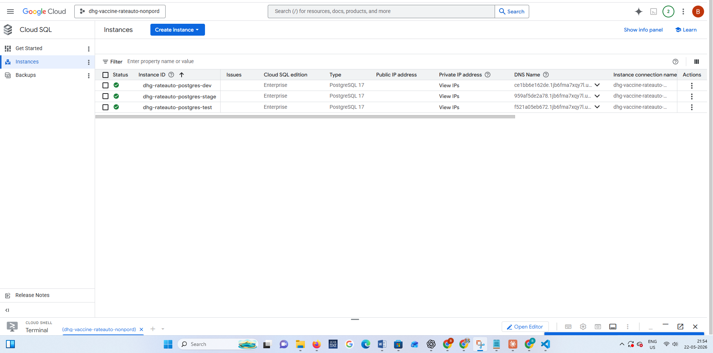
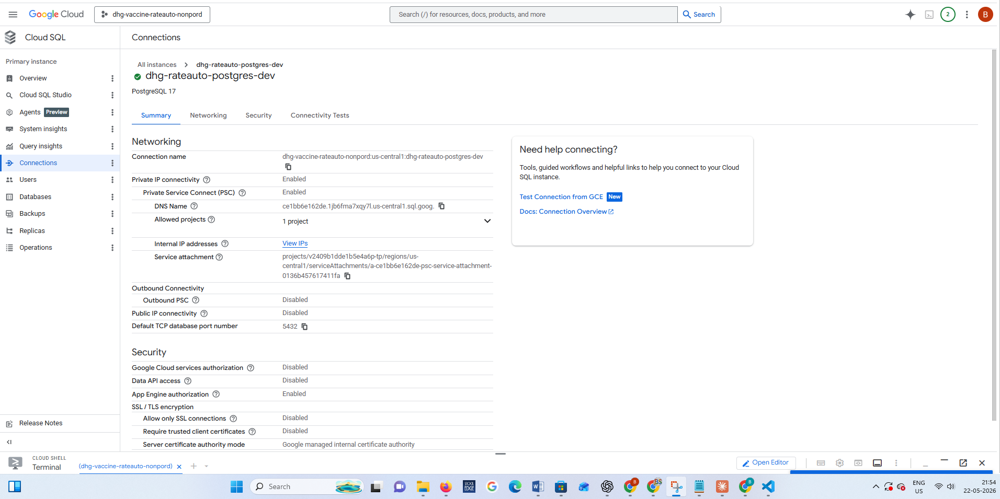
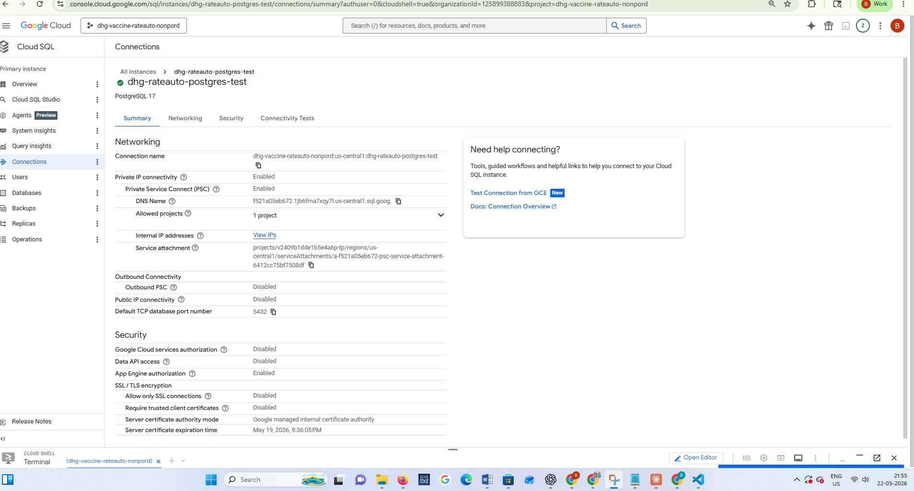
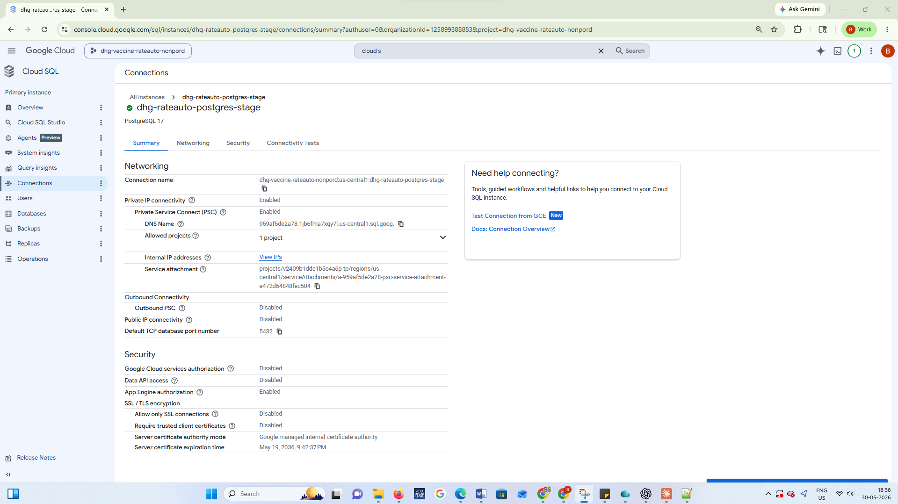
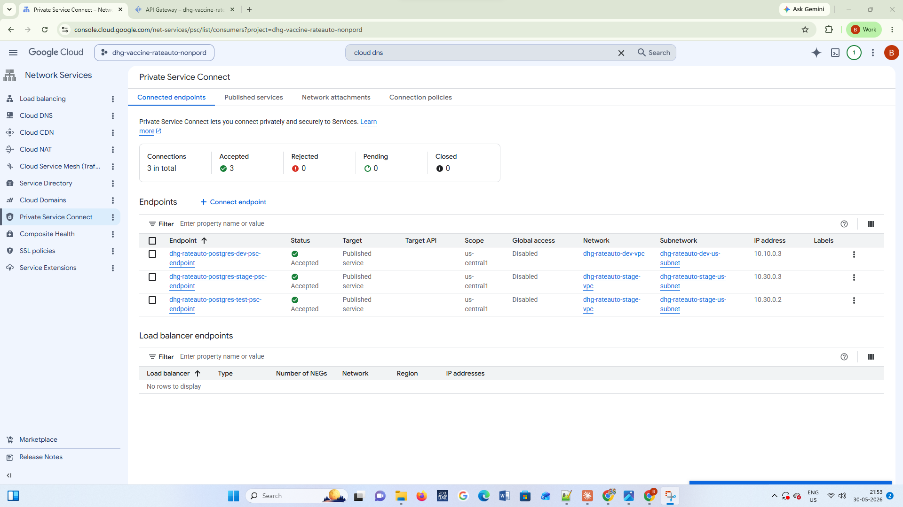

<div align="center">


# 🐘 dhg-rateauto-tf-postgres

### Terraform · Cloud SQL PostgreSQL · Private Service Connect
### DHG Rate Automation Platform - `dhg-vaccine-rateauto-nonpord`

[](https://www.terraform.io)
[](https://cloud.google.com/sql/docs/postgres)
[](https://cloud.google.com/vpc/docs/private-service-connect)
[](https://registry.terraform.io/providers/hashicorp/google/latest)
[](https://cloud.google.com/iam/docs/workload-identity-federation)
[]()

---

*Provisions a fully managed Cloud SQL PostgreSQL instance with Private Service Connect (PSC) - zero public internet exposure, automated backups, high availability, and enterprise-grade security for the DHG Vaccine Fee pricing platform.*

</div>

---

## 📋 Table of Contents

- [Overview](#-overview)
- [UI Gallery](#-ui-gallery)
- [Why Cloud SQL with PSC](#-why-cloud-sql-with-psc)
- [Architecture](#-architecture)
- [Repository Structure](#-repository-structure)
- [Prerequisites](#-prerequisites)
- [Resources Created](#-resources-created)
- [File-by-File Breakdown](#-file-by-file-breakdown)
- [Variables Reference](#-variables-reference)
- [Outputs Reference](#-outputs-reference)
- [Database Configuration Deep Dive](#-database-configuration-deep-dive)
- [Private Service Connect Explained](#-private-service-connect-explained)
- [Backup & Recovery](#-backup--recovery)
- [High Availability](#-high-availability)
- [Environments](#-environments)
- [Usage](#-usage)
- [Connecting to the Database](#-connecting-to-the-database)
- [Database Schema](#-database-schema)
- [CI/CD Pipeline](#-cicd-pipeline)
- [Security](#-security)
- [Provider Versions](#-provider-versions)
- [Related Repositories](#-related-repositories)

---

## 🌐 Overview

This repository provisions a **Cloud SQL PostgreSQL instance** for the DHG Rate Automation platform using Terraform. The database is the **data backbone** of the entire platform - storing vaccine pricing records, hospital information, departments, users, and 5,000+ pricing entries.

The key architectural decision is **Private Service Connect (PSC)** - the database has **no public IP address** and is completely inaccessible from the internet. The only way to reach it is through a private internal IP (`10.10.0.3`) within the VPC, from GKE pods running the FastAPI backend.

### 🔑 Key Facts

| Property | Value |
|---|---|
| 🐘 **Database Engine** | PostgreSQL (Cloud SQL) |
| 🌍 **Region** | `us-central1` |
| 🔒 **Access** | Private only - no public IP |
| 📍 **Private IP (PSC)** | `10.10.0.3:5432` |
| 🏗️ **Database Name** | `dhg-vaccinefee-db` |
| 👤 **DB User** | `dhg-vaccinefee-user` |
| 💾 **Storage** | SSD with auto-resize |
| 🔄 **Backups** | Daily automated, 7 retained |
| 🛡️ **Availability** | Configurable (ZONAL / REGIONAL) |
| 🔐 **Password** | Stored in GitHub Secrets, injected via WIF |

---

## 🖼️ UI Gallery

> 📌 **Note:** All images are stored in `docs/gallery/`. Upload your screenshots there to display them here.

### 🐘 Cloud SQL Instances - GCP Console


---

### 🟢 Dev Instance - Details


---

### 🟡 Test Instance - Details


---

### 🔵 Stage Instance - Details


---

### 🔌 Postgres PSC Endpoint


---


## ⚡ Why Cloud SQL with PSC

### Cloud SQL vs Self-Managed PostgreSQL on GKE

| Feature | Self-managed PostgreSQL | Cloud SQL ✅ |
|---|---|---|
| **Backups** | Manual setup required | Automated daily + PITR |
| **Patching** | Manual | Google-managed |
| **Failover** | Complex setup | Automatic (Regional HA) |
| **Scaling** | Pod resource requests | Instance tier upgrade |
| **Storage** | PVC management | Auto-resize |
| **Monitoring** | DIY | Built-in Cloud Monitoring |
| **Operational burden** | Very high | Minimal |
| **SLA** | None | 99.95% (Regional HA) |

### Why PSC over Public IP

| Access Method | Security | Complexity | Cost |
|---|---|---|---|
| Public IP + SSL | Exposed to internet scans | Simple | Low |
| Private IP (VPC Peering) | VPC-only access | Moderate | Low |
| **PSC (our choice) ✅** | **Fully private, no peering** | **Moderate** | **Low** |

PSC creates a **one-way private tunnel** from the consumer VPC (our GKE VPC) to the Cloud SQL producer network - without VPC peering, without route conflicts, and without any internet exposure.

---

## 🏛️ Architecture

```
┌──────────────────────────────────────────────────────────────────────┐
│             GCP Project: dhg-vaccine-rateauto-nonpord                 │
│                                                                        │
│  ┌────────────────────────────────────────────────────────────────┐   │
│  │              VPC: dhg-rateauto-dev-vpc                          │   │
│  │              Subnet: 10.10.0.0/20                               │   │
│  │                                                                  │   │
│  │  ┌─────────────────────────────────────────────────────────┐   │   │
│  │  │           GKE Autopilot Cluster                          │   │   │
│  │  │                                                           │   │   │
│  │  │   ┌──────────────┐        ┌─────────────────────────┐   │   │   │
│  │  │   │  FastAPI Pod  │──────▶│  K8s Secret              │   │   │   │
│  │  │   │  :8080        │       │  dhg-vaccinefee-db-secret │   │   │   │
│  │  │   └──────┬───────┘       │  DB_HOST=10.10.0.3        │   │   │   │
│  │  │          │               │  DB_PORT=5432              │   │   │   │
│  │  │          │ asyncpg       │  DB_USER=...               │   │   │   │
│  │  │          │ SQLAlchemy    └─────────────────────────────┘   │   │   │
│  │  └──────────┼──────────────────────────────────────────────────┘   │   │
│  │             │                                                   │   │
│  │             ▼                                                   │   │
│  │  ┌──────────────────────────┐                                  │   │
│  │  │  PSC Forwarding Rule      │                                  │   │
│  │  │  dhg-vaccinefee-psc-fwd  │                                  │   │
│  │  │  load_balancing_scheme="" │                                  │   │
│  │  └──────────┬───────────────┘                                  │   │
│  │             │                                                   │   │
│  │  ┌──────────▼───────────────┐                                  │   │
│  │  │  Internal IP Address      │                                  │   │
│  │  │  dhg-vaccinefee-psc-ip   │                                  │   │
│  │  │  10.10.0.3 (static)      │                                  │   │
│  │  └──────────┬───────────────┘                                  │   │
│  └─────────────┼──────────────────────────────────────────────────┘   │
│                │  PSC Tunnel (private, no internet)                    │
│                ▼                                                        │
│  ┌─────────────────────────────────────────────────────────────────┐   │
│  │          Google Managed Network (Cloud SQL Producer)             │   │
│  │                                                                   │   │
│  │  ┌────────────────────────────────────────────────────────┐     │   │
│  │  │   Cloud SQL Instance: dhg-vaccinefee-db               │     │   │
│  │  │   Engine:    PostgreSQL 14                             │     │   │
│  │  │   Tier:      db-custom-2-4096 (2 CPU, 4GB RAM)        │     │   │
│  │  │   Disk:      SSD, 20GB, auto-resize                   │     │   │
│  │  │   Backup:    Daily 00:00 UTC, 7 retained              │     │   │
│  │  │   IPv4:      DISABLED (no public IP)                  │     │   │
│  │  │   PSC:       ENABLED                                  │     │   │
│  │  │                                                        │     │   │
│  │  │   Databases:                                          │     │   │
│  │  │   └── dhg-vaccinefee-db                               │     │   │
│  │  │         ├── hospitals    (~150 rows)                  │     │   │
│  │  │         ├── vaccines     (~40 rows)                   │     │   │
│  │  │         ├── departments  (13 rows)                    │     │   │
│  │  │         ├── pricing      (5,000+ rows)               │     │   │
│  │  │         └── users        (2 rows)                     │     │   │
│  │  └────────────────────────────────────────────────────────┘     │   │
│  └─────────────────────────────────────────────────────────────────┘   │
└──────────────────────────────────────────────────────────────────────┘
```

---

## 📁 Repository Structure

```
dhg-rateauto-tf-postgres/
│
├── 📁 .github/
│   └── 📁 workflows/
│       └── 📄 terraform.yml        # CI/CD: plan on PR, apply on merge
│
├── 📁 environments/
│   └── 📄 dev.tfvars               # Dev DB config (instance name, tier, etc.)
│
├── 📄 main.tf                      # Cloud SQL instance, DB user, PSC resources (71 lines)
├── 📄 variables.tf                 # All 26 input variables (143 lines)
├── 📄 output.tf                    # 10 outputs including PSC connection instructions
├── 📄 providers.tf                 # Google provider configuration
├── 📄 terraform.tf                 # GCS backend configuration
└── 📄 README.md                    # This file
```

---

## ✅ Prerequisites

| Requirement | Details |
|---|---|
| 🏗️ **VPC deployed** | `dhg-rateauto-tf-vpc` must be applied first |
| 🔧 **Terraform** | `>= 1.4` |
| ☁️ **Google Provider** | `~> 5.0` |
| 🔌 **APIs enabled** | `sqladmin.googleapis.com`, `servicenetworking.googleapis.com`, `compute.googleapis.com` |
| 🔐 **IAM permissions** | `roles/cloudsql.admin`, `roles/compute.networkAdmin` |
| 🔑 **DB password** | Must be stored as GitHub Secret `DB_PASSWORD` - never in code |

Enable required APIs:

```bash
gcloud services enable \
  sqladmin.googleapis.com \
  servicenetworking.googleapis.com \
  compute.googleapis.com \
  --project=dhg-vaccine-rateauto-nonpord
```

---

## 📦 Resources Created

| # | Resource | Terraform Name | Description |
|---|---|---|---|
| 1 | `google_sql_database_instance` | `dbtest1` | Cloud SQL PostgreSQL instance with PSC |
| 2 | `google_sql_user` | `db_user` | Database user with password from GitHub Secret |
| 3 | `google_compute_address` | `psc_ip_address` | Internal static IP for PSC endpoint (`10.10.0.3`) |
| 4 | `google_compute_forwarding_rule` | `consumer_psc_endpoint` | PSC forwarding rule connecting IP to Cloud SQL |

**Total: 4 resources** - clean and purpose-built.

---

## 🔍 File-by-File Breakdown

### 📄 `main.tf` - Core Resources (71 lines)

The entire infrastructure in 4 resource blocks:

#### Block 1: Cloud SQL Instance

```hcl
resource "google_sql_database_instance" "dbtest1" {
  name             = var.instance_name        # "dhg-vaccinefee-db"
  database_version = var.database_version     # "POSTGRES_14"
  region           = var.region               # "us-central1"
  project          = var.project
  deletion_protection = var.deletion_protection  # true in prod

  settings {
    tier              = var.tier              # "db-custom-2-4096"
    edition           = var.edition           # "ENTERPRISE"
    disk_type         = var.disk_type         # "PD_SSD"
    disk_size         = var.disk_size         # 20
    disk_autoresize   = var.disk_autoresize   # true
    availability_type = var.availability_type # "ZONAL" or "REGIONAL"

    user_labels = {
      environment = var.environment
      team        = var.team
    }
    ...
  }
}
```

#### Block 2: Database User

```hcl
resource "google_sql_user" "db_user" {
  name     = var.db_user      # "dhg-vaccinefee-user"
  instance = google_sql_database_instance.dbtest1.name
  project  = var.project
  password = var.db_password  # ← from GitHub Secret, sensitive=true
}
```

> 🔐 The password is marked `sensitive = true` in `variables.tf` - it never appears in plan/apply output or logs. It is passed directly from the GitHub Secret `DB_PASSWORD` via the CI/CD workflow.

#### Block 3: PSC Internal IP

```hcl
resource "google_compute_address" "psc_ip_address" {
  name         = var.psc_ip_name         # "dhg-vaccinefee-psc-ip"
  project      = var.project
  region       = var.region
  subnetwork   = var.subnetwork          # VPC subnet
  address_type = "INTERNAL"             # ← Private IP, not public
}
```

This reserves a **static internal IP** from the VPC subnet range. By reserving it (rather than letting it be ephemeral), the IP `10.10.0.3` never changes - GKE pods and K8s secrets always use the same address.

#### Block 4: PSC Forwarding Rule

```hcl
resource "google_compute_forwarding_rule" "consumer_psc_endpoint" {
  name                  = var.psc_endpoint_name
  project               = var.project
  region                = var.region
  load_balancing_scheme = ""   # ← Must be empty string for PSC
  target                = google_sql_database_instance.dbtest1.psc_service_attachment_link
  network               = var.network
  subnetwork            = var.subnetwork
  ip_address            = google_compute_address.psc_ip_address.self_link
}
```

The **forwarding rule** is the bridge between the private IP and the Cloud SQL PSC service attachment. `load_balancing_scheme = ""` (empty string) is a specific requirement for PSC forwarding rules - it tells GCP this is a PSC consumer endpoint, not a load balancer.

---

### 📄 `variables.tf` - 26 Input Variables (143 lines)

Covers 5 groups of variables - see the full [Variables Reference](#-variables-reference).

Notable: `db_password` is the only `sensitive = true` variable - ensuring the password is never printed in logs.

---

### 📄 `output.tf` - 10 Outputs (60 lines)

The most valuable output is `psc_connection_instructions` - a heredoc that prints the complete connection details:

```hcl
output "psc_connection_instructions" {
  value = <<-EOT
    Connect to PostgreSQL using PSC:
    Host: ${google_compute_address.psc_ip_address.address}
    Port: 5432
    Username: ${var.db_user}

    Connection string:
    postgresql://${var.db_user}:YOUR_PASSWORD@${...address}:5432/postgres

    psql command:
    psql -h ${...address} -p 5432 -U ${var.db_user} -d postgres
  EOT
}
```

After `terraform apply`, run `terraform output psc_connection_instructions` to get ready-to-use connection strings.

---

## 📊 Variables Reference

### 🏗️ Core Identity

| Variable | Type | Required | Description |
|---|---|---|---|
| `project` | `string` | ✅ | GCP project ID |
| `region` | `string` | ✅ | GCP region (e.g. `us-central1`) |
| `environment` | `string` | ✅ | Label: `dev`, `stage`, `prod` |
| `team` | `string` | ✅ | Label: team name (e.g. `platform`) |
| `service-tier` | `string` | No | Label: service priority tier (default `""`) |

### 🐘 Cloud SQL Instance

| Variable | Type | Default | Required | Description |
|---|---|---|---|---|
| `instance_name` | `string` | - | ✅ | Cloud SQL instance name |
| `database_version` | `string` | - | ✅ | PostgreSQL version (e.g. `POSTGRES_14`) |
| `tier` | `string` | - | ✅ | Machine type (e.g. `db-custom-2-4096`) |
| `edition` | `string` | - | ✅ | `ENTERPRISE` or `ENTERPRISE_PLUS` |
| `disk_type` | `string` | - | ✅ | `PD_SSD` or `PD_HDD` |
| `disk_size` | `number` | - | ✅ | Initial disk size in GB |
| `disk_autoresize` | `bool` | - | ✅ | Auto-grow disk when full |
| `availability_type` | `string` | - | ✅ | `ZONAL` (single zone) or `REGIONAL` (HA) |
| `cpu_count` | `number` | - | ✅ | Number of vCPUs (for custom tier) |
| `memory_size_gb` | `number` | - | ✅ | RAM in GB (for custom tier) |
| `deletion_protection` | `bool` | `true` | No | Prevent accidental deletion |

### 👤 Database User

| Variable | Type | Sensitive | Required | Description |
|---|---|---|---|---|
| `db_user` | `string` | No | ✅ | Database username |
| `db_password` | `string` | 🔒 Yes | ✅ | Database password (from GitHub Secret) |

### 🔒 Private Service Connect

| Variable | Type | Required | Description |
|---|---|---|---|
| `network` | `string` | ✅ | VPC network name (from `dhg-rateauto-tf-vpc`) |
| `subnetwork` | `string` | ✅ | Subnet name (from `dhg-rateauto-tf-vpc`) |
| `psc_ip_name` | `string` | ✅ | Name for the reserved internal PSC IP |
| `psc_endpoint_name` | `string` | ✅ | Name for the PSC forwarding rule |

### 💾 Backup & Retention

| Variable | Type | Default | Description |
|---|---|---|---|
| `backup_location` | `string` | `us` | Multi-region backup storage location |
| `log_retention_days` | `number` | `7` | Transaction log retention days (1–7) |
| `retained_backups` | `number` | `7` | Number of automated backups to keep |
| `retain_backups_on_delete` | `bool` | `true` | Keep backups after instance is deleted |
| `final_backup_on_delete` | `bool` | `true` | Create one last backup before deletion |

---

## 📤 Outputs Reference

| Output | Sensitive | Description |
|---|---|---|
| `connection_name` | No | Cloud SQL connection name (`project:region:instance`) |
| `database_instance_name` | No | Instance name |
| `instance_edition` | No | `ENTERPRISE` or `ENTERPRISE_PLUS` |
| `instance_db_version` | No | e.g. `POSTGRES_14` |
| `instance_region` | No | GCP region |
| `instance_machine_type` | No | Tier name |
| `instance_disk_type` | No | `PD_SSD` or `PD_HDD` |
| `instance_disk_size` | No | Disk size in GB |
| `psc_ip_address` | No | Private IP address (`10.10.0.3`) |
| `psc_endpoint_name` | No | Forwarding rule name |
| `psc_connection_instructions` | No | Full connection strings (host, port, user, psql command) |

---

## 🔬 Database Configuration Deep Dive

### Instance Tier - `db-custom-2-4096`

Cloud SQL supports predefined and custom tiers:

```
db-custom-<vCPUs>-<memory-in-MB>
db-custom-2-4096 = 2 vCPUs + 4 GB RAM
```

| Tier | vCPUs | RAM | Use Case |
|---|---|---|---|
| `db-f1-micro` | Shared | 0.6 GB | Dev/test only |
| `db-g1-small` | Shared | 1.7 GB | Light workloads |
| `db-custom-2-4096` ✅ | 2 | 4 GB | **Our choice - dev/stage** |
| `db-custom-4-8192` | 4 | 8 GB | Production |
| `db-custom-8-16384` | 8 | 16 GB | High-traffic production |

### Edition - `ENTERPRISE`

| Edition | Features | Cost |
|---|---|---|
| `ENTERPRISE` ✅ | Standard HA, backups, replicas | Standard |
| `ENTERPRISE_PLUS` | Data cache, advanced queries | Premium |

### Availability Type

| Type | Description | Downtime on failure |
|---|---|---|
| `ZONAL` ✅ (dev) | Single zone - primary only | ~60 seconds |
| `REGIONAL` (prod) | Primary + standby in different zones | ~30 seconds automatic failover |

### Disk Configuration

```hcl
disk_type       = "PD_SSD"   # SSD for low latency
disk_size       = 20          # 20 GB initial
disk_autoresize = true        # Auto-grows - no manual intervention needed
```

> ⚠️ **Auto-resize only grows, never shrinks.** If temporary bulk inserts inflate the disk, it will stay at the larger size. Monitor disk usage in Cloud Monitoring.

---

## 🔐 Private Service Connect Explained

### What is PSC?

Private Service Connect (PSC) is a Google Cloud networking feature that allows private consumption of services across VPC networks **without VPC peering**. Instead of peering two VPCs (which has IP range conflict risks), PSC creates a **one-directional endpoint** from the consumer (our GKE VPC) to the producer (Cloud SQL managed network).

### How it Works

```
GKE Pod
  │  Connects to 10.10.0.3:5432
  │  (private IP in our subnet)
  ▼
PSC Forwarding Rule
  │  Forwards traffic through the PSC tunnel
  │  load_balancing_scheme = "" (PSC-specific)
  ▼
PSC Service Attachment
  │  (google_sql_database_instance.psc_service_attachment_link)
  │  Auto-generated by Cloud SQL when PSC is enabled
  ▼
Cloud SQL Instance
  │  Receives connection on its internal network interface
  │  NO public IP involved at any step
  ▼
PostgreSQL port 5432
```

### PSC vs VPC Peering

| Feature | VPC Peering | PSC ✅ |
|---|---|---|
| IP conflicts | Possible if ranges overlap | Not possible |
| Directionality | Bidirectional | One-way (consumer → producer) |
| Route propagation | Full route exchange | No route exchange |
| Transitivity | Not transitive | Not transitive (by design) |
| DNS | Manual configuration | Auto DNS available |
| Complexity | Moderate | Low |

### PSC IP is Static

The internal IP `10.10.0.3` is **reserved** (not ephemeral):
- ✅ GKE pods always connect to the same IP
- ✅ K8s Secret `DB_HOST=10.10.0.3` never needs updating
- ✅ Application connection strings don't change on infra updates

---

## 💾 Backup & Recovery

### Automated Backup Configuration

```hcl
backup_configuration {
  enabled                        = true
  start_time                     = "00:00"     # Midnight UTC = 5:30 AM IST
  location                       = "us"        # Multi-region storage
  point_in_time_recovery_enabled = false       # PITR disabled (can enable)
  transaction_log_retention_days = 7           # 1 week of logs

  backup_retention_settings {
    retained_backups = 7          # Keep 7 daily backups (1 week)
    retention_unit   = "COUNT"    # Count-based, not time-based
  }
}
```

### Backup Schedule

| Setting | Value | Notes |
|---|---|---|
| **Start time** | `00:00 UTC` | 5:30 AM IST - low traffic |
| **Location** | `us` (multi-region) | Backups in multiple US regions |
| **Retained backups** | `7` | One week of recovery points |
| **Log retention** | `7 days` | For transaction log recovery |
| **PITR** | Disabled | Can enable for 7-day point-in-time recovery |

### Recovery Options

```bash
# List available backups
gcloud sql backups list \
  --instance=dhg-vaccinefee-db \
  --project=dhg-vaccine-rateauto-nonpord

# Restore from a specific backup
gcloud sql backups restore BACKUP_ID \
  --restore-instance=dhg-vaccinefee-db \
  --backup-instance=dhg-vaccinefee-db \
  --project=dhg-vaccine-rateauto-nonpord
```

### Protection on Delete

```hcl
retain_backups_on_delete = true   # Backups survive instance deletion
final_backup_on_delete   = true   # One last backup before destroy
deletion_protection      = true   # Prevents terraform destroy (prod)
```

This three-layer protection ensures you can never accidentally lose data.

---

## 🔄 High Availability

### Current Setup (Dev) - ZONAL

```hcl
availability_type = "ZONAL"
```

Single zone deployment - suitable for development and testing. If the zone goes down, Cloud SQL automatically restarts the instance (approximately 60 seconds of downtime).

### Production Recommendation - REGIONAL

```hcl
availability_type = "REGIONAL"
```

Regional HA provisions a **standby instance in a different zone** within the same region. Automatic failover occurs in ~30 seconds - no manual intervention required.

```
Primary Zone (us-central1-a)     Standby Zone (us-central1-b)
┌─────────────────────────┐     ┌─────────────────────────┐
│  Cloud SQL Primary       │────▶│  Cloud SQL Standby       │
│  Read + Write            │     │  Read only (sync)        │
└─────────────────────────┘     └─────────────────────────┘
         │
         │ Automatic failover if primary fails
         ▼
┌─────────────────────────┐
│  Standby promoted to     │
│  Primary automatically   │
└─────────────────────────┘
```

---

## 🌍 Environments

### Example `environments/dev.tfvars`

```hcl
# ── Core ──────────────────────────────────────────────────────
project     = "dhg-vaccine-rateauto-nonpord"
region      = "us-central1"
environment = "dev"
team        = "platform"

# ── Networking (from dhg-rateauto-tf-vpc outputs) ─────────────
network    = "dhg-rateauto-dev-vpc"
subnetwork = "dhg-rateauto-dev-subnet"

# ── Instance ──────────────────────────────────────────────────
instance_name     = "dhg-vaccinefee-db"
database_version  = "POSTGRES_14"
tier              = "db-custom-2-4096"
edition           = "ENTERPRISE"
disk_type         = "PD_SSD"
disk_size         = 20
disk_autoresize   = true
availability_type = "ZONAL"     # REGIONAL for prod
cpu_count         = 2
memory_size_gb    = 4

# ── Database User ─────────────────────────────────────────────
db_user     = "dhg-vaccinefee-user"
# db_password → injected from GitHub Secret DB_PASSWORD

# ── PSC ───────────────────────────────────────────────────────
psc_ip_name       = "dhg-vaccinefee-psc-ip"
psc_endpoint_name = "dhg-vaccinefee-psc-fwd"

# ── Backup ────────────────────────────────────────────────────
backup_location          = "us"
log_retention_days       = 7
retained_backups         = 7
deletion_protection      = false   # true for prod
retain_backups_on_delete = true
final_backup_on_delete   = true
```

### Environment Comparison

| Setting | Dev | Stage | Prod |
|---|---|---|---|
| `availability_type` | `ZONAL` | `ZONAL` | `REGIONAL` |
| `tier` | `db-custom-2-4096` | `db-custom-2-4096` | `db-custom-4-8192` |
| `disk_size` | 20 GB | 50 GB | 100 GB |
| `deletion_protection` | `false` | `true` | `true` |
| `retained_backups` | 7 | 14 | 30 |
| SLA | None | 99.95% | 99.95% |

---

## 🚀 Usage

### 🖥️ Local Deployment

```bash
# 1. Clone the repo
git clone https://github.com/bikram-singh/dhg-rateauto-tf-postgres.git
cd dhg-rateauto-tf-postgres

# 2. Authenticate with GCP
gcloud auth application-default login

# 3. Initialise Terraform
terraform init

# 4. Plan - provide DB password via env var (never in tfvars!)
export TF_VAR_db_password="YourSecurePassword123!"
terraform plan -var-file=environments/dev.tfvars -out=tfplan

# 5. Apply
terraform apply -auto-approve -input=false tfplan

# 6. View connection details
terraform output psc_connection_instructions
```

### ✅ Verify Database is Running

```bash
# Check instance status
gcloud sql instances describe dhg-vaccinefee-db \
  --project=dhg-vaccine-rateauto-nonpord \
  --format="table(name,state,databaseVersion,settings.tier)"

# Check PSC endpoint
gcloud compute forwarding-rules describe dhg-vaccinefee-psc-fwd \
  --region=us-central1 \
  --project=dhg-vaccine-rateauto-nonpord

# Check reserved IP
gcloud compute addresses describe dhg-vaccinefee-psc-ip \
  --region=us-central1 \
  --project=dhg-vaccine-rateauto-nonpord
```

---

## 🔌 Connecting to the Database

### From GKE Pods (Production Method)

GKE pods connect using the PSC private IP via environment variables injected from K8s Secrets:

```yaml
# K8s Secret
apiVersion: v1
kind: Secret
metadata:
  name: dhg-vaccinefee-db-secret
  namespace: dhg-rateauto-dev-namespace
type: Opaque
data:
  DB_HOST: MTAuMTAuMC4z        # base64("10.10.0.3")
  DB_PORT: NTQzMg==            # base64("5432")
  DB_NAME: ZGhnLXZhY2NpbmVmZWUtZGI=
  DB_USER: ZGhnLXZhY2NpbmVmZWUtdXNlcg==
  DB_PASSWORD: <from-github-secret>
```

FastAPI backend connection via `asyncpg`:

```python
# database.py
DATABASE_URL = (
  f"postgresql+asyncpg://{DB_USER}:{DB_PASSWORD}"
  f"@{DB_HOST}:{DB_PORT}/{DB_NAME}"
)
engine = create_async_engine(DATABASE_URL)
```

### From Cloud Shell (Admin/Debug)

Connect via the Cloud SQL Auth Proxy for admin work:

```bash
# Download and run Cloud SQL Auth Proxy
./cloud-sql-proxy dhg-vaccine-rateauto-nonpord:us-central1:dhg-vaccinefee-db \
  --port 5432 &

# Connect with psql
psql -h 127.0.0.1 -p 5432 -U dhg-vaccinefee-user -d dhg-vaccinefee-db
```

### From a GKE Pod (Direct Debug)

```bash
# Exec into a running pod
kubectl exec -it -n dhg-rateauto-dev-namespace \
  $(kubectl get pod -n dhg-rateauto-dev-namespace -l app=dhg-vaccinefee-api \
  -o jsonpath='{.items[0].metadata.name}') -- bash

# Connect directly via PSC IP (psql must be installed)
psql -h 10.10.0.3 -p 5432 -U dhg-vaccinefee-user -d dhg-vaccinefee-db
```

---

## 🗄️ Database Schema

The FastAPI backend uses SQLAlchemy async models. The database contains 5 tables:

```sql
-- Hospitals (~150 rows - India, USA, Europe, Asia, Middle East)
CREATE TABLE hospitals (
  id       SERIAL PRIMARY KEY,
  name     VARCHAR(200) NOT NULL,
  location VARCHAR(200),           -- "Delhi, India" / "New York, USA"
  address  VARCHAR(500)            -- Full street address
);

-- Vaccines (40 rows - real manufacturers and names)
CREATE TABLE vaccines (
  id           SERIAL PRIMARY KEY,
  name         VARCHAR(200) NOT NULL,
  manufacturer VARCHAR(200),
  description  TEXT
);

-- Departments (13 rows)
CREATE TABLE departments (
  id          SERIAL PRIMARY KEY,
  name        VARCHAR(100) NOT NULL,
  description TEXT
);

-- Pricing (5,000+ rows)
CREATE TABLE pricing (
  id                SERIAL PRIMARY KEY,
  vaccine_id        INTEGER REFERENCES vaccines(id),
  hospital_id       INTEGER REFERENCES hospitals(id),
  department_id     INTEGER REFERENCES departments(id),
  price             NUMERIC(10,2),
  status            VARCHAR(50),   -- Available/Low Stock/Out of Stock
  insurance_covered VARCHAR(10),   -- Yes/No/Vco
  stock_quantity    INTEGER
);

-- Users (2 rows - bikram/Admin, viewer/Viewer)
CREATE TABLE users (
  id            SERIAL PRIMARY KEY,
  username      VARCHAR(50) UNIQUE NOT NULL,
  password_hash VARCHAR(200) NOT NULL,   -- bcrypt hash
  full_name     VARCHAR(100),
  role          VARCHAR(20) DEFAULT 'Viewer',
  is_active     BOOLEAN DEFAULT TRUE,
  created_at    TIMESTAMP DEFAULT NOW()
);
```

---

## ⚙️ CI/CD Pipeline

### 🔄 Pipeline Flow

```
┌──────────────────────────────────────────────────────────┐
│                  On Pull Request                          │
│  terraform fmt → terraform init → terraform validate     │
│                                → terraform plan          │
│                                  (posted as PR comment)  │
└──────────────────────────────────────────────────────────┘

┌──────────────────────────────────────────────────────────┐
│                  On Push to main                          │
│  terraform init → terraform plan -out=tfplan             │
│               → terraform apply -auto-approve            │
└──────────────────────────────────────────────────────────┘
```

### 🔐 Password Injection via GitHub Secrets

The database password is **never stored in tfvars, code, or state** in plain text:

```yaml
# .github/workflows/terraform.yml
- name: Terraform Apply
  env:
    TF_VAR_db_password: ${{ secrets.DB_PASSWORD }}
  run: terraform apply -auto-approve -input=false tfplan
```

The GitHub Secret `DB_PASSWORD` is injected as a Terraform variable at runtime. Terraform marks it as sensitive so it never appears in logs.

### 🔑 Required IAM Roles

| Role | Purpose |
|---|---|
| `roles/cloudsql.admin` | Create/modify Cloud SQL instances and users |
| `roles/compute.networkAdmin` | Reserve internal IP, create forwarding rule |
| `roles/storage.objectAdmin` | Read/write Terraform state in GCS |
| `roles/iam.serviceAccountUser` | Impersonate the service account |

---

## 🔒 Security

### 🛡️ Multi-Layer Database Security

```
Layer 1 - No Public IP:    ipv4_enabled = false
                           PSC only - no internet exposure at all

Layer 2 - PSC Isolation:   One-way tunnel - only our VPC can reach DB
                           No route propagation, no bidirectional access

Layer 3 - Auth:            Username + bcrypt password
                           Password stored as GitHub Secret
                           Never in code, never in logs, never in state

Layer 4 - TLS:             Cloud SQL enforces SSL/TLS for all connections
                           Certificate validation by default

Layer 5 - GKE Access:      Only pods in dhg-rateauto-dev-namespace
                           connect via K8s Secret env vars
                           No hardcoded credentials in application code

Layer 6 - Backups:         Encrypted at rest
                           Stored in multi-region US locations
                           7-day retention with final backup on delete

Layer 7 - CI/CD:           WIF - no JSON keys
                           Password from GitHub Secret
                           Sensitive variables never logged
```

### 🔐 Credential Flow

```
GitHub Secret DB_PASSWORD
        │
        ▼ (injected at CI/CD runtime)
Terraform Variable (sensitive=true)
        │
        ▼ (stored encrypted in state)
Cloud SQL User Password
        │
        ▼ (referenced by FastAPI)
K8s Secret dhg-vaccinefee-db-secret
        │
        ▼ (env var injection)
FastAPI Pod → asyncpg connection
```

---

## 📌 Provider Versions

```hcl
# terraform.tf / versions.tf
terraform {
  required_version = ">= 1.4"

  required_providers {
    google = {
      source  = "hashicorp/google"
      version = "~> 5.0"
    }
  }
}

# providers.tf
provider "google" {
  project = var.project
  region  = var.region
}
```

---

## 🔗 Related Repositories

| Repository | Purpose | Deploy Order |
|---|---|---|
| [`dhg-rateauto-tf-vpc`](https://github.com/bikram-singh/dhg-rateauto-tf-vpc) | VPC, Subnet, NAT, Firewall | 1️⃣ First |
| [`dhg-rateauto-tf-postgres`](https://github.com/bikram-singh/dhg-rateauto-tf-postgres) | **This repo** - Cloud SQL PostgreSQL + PSC | 2️⃣ Second (parallel with GKE) |
| [`dhg-rateauto-tf-gke`](https://github.com/bikram-singh/dhg-rateauto-tf-gke) | GKE Autopilot Cluster | 2️⃣ Second (parallel with Postgres) |
| [`dhg-rateauto-tf-gke-routing`](https://github.com/bikram-singh/dhg-rateauto-tf-gke-routing) | Gateway API, HTTPS, Routing | 3️⃣ Third |
| [`dhg-rateauto-tf-gcs-buckets`](https://github.com/bikram-singh/dhg-rateauto-tf-gcs-buckets) | GCS Bucket Provisioning | 4️⃣ Independent |
| [`dhg-rateauto-api-backend`](https://github.com/bikram-singh/dhg-rateauto-api-backend) | FastAPI Backend | 5️⃣ App layer |
| [`dhg-rateauto-ui-frontend`](https://github.com/bikram-singh/dhg-rateauto-ui-frontend) | React Frontend Dashboard | 5️⃣ App layer |

---

<div align="center">

**Maintained by Bikram Singh**
`dhg-vaccine-rateauto-nonpord` · `us-central1` · Cloud SQL PostgreSQL + PSC

</div>